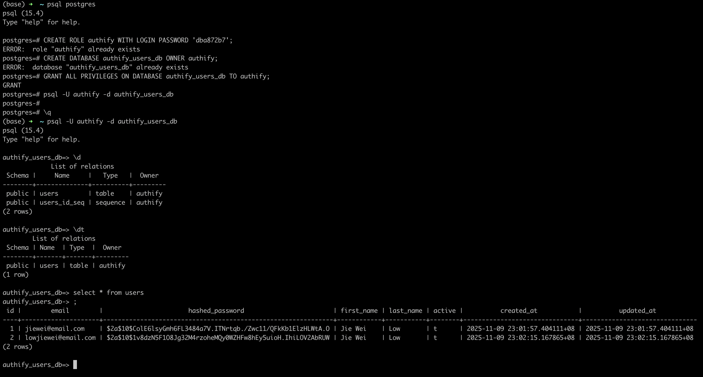
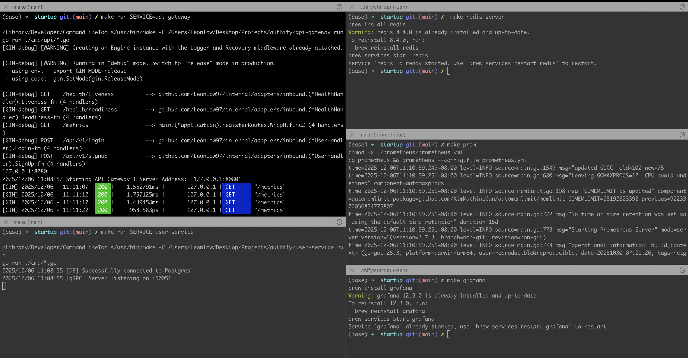
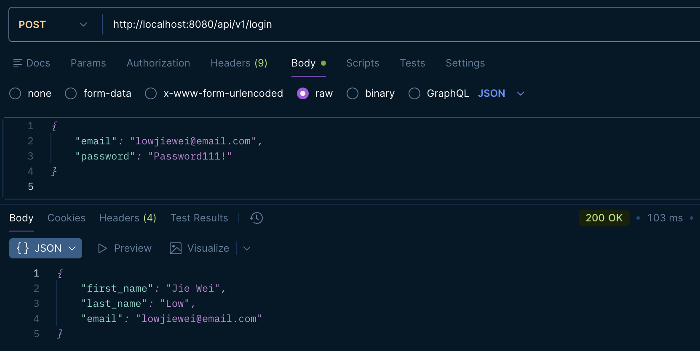
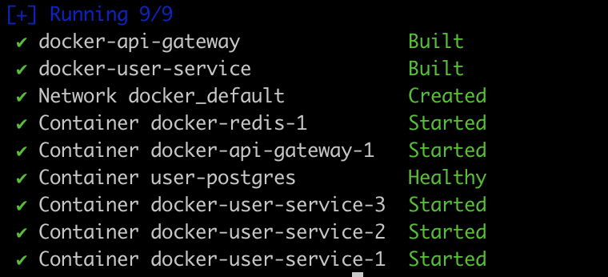
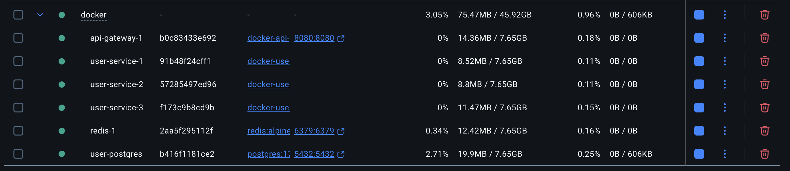
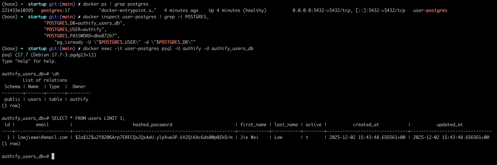
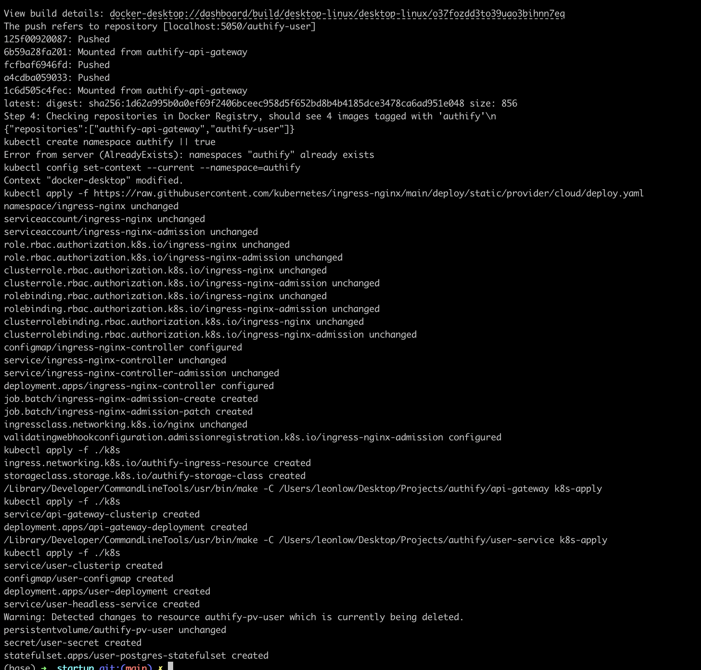
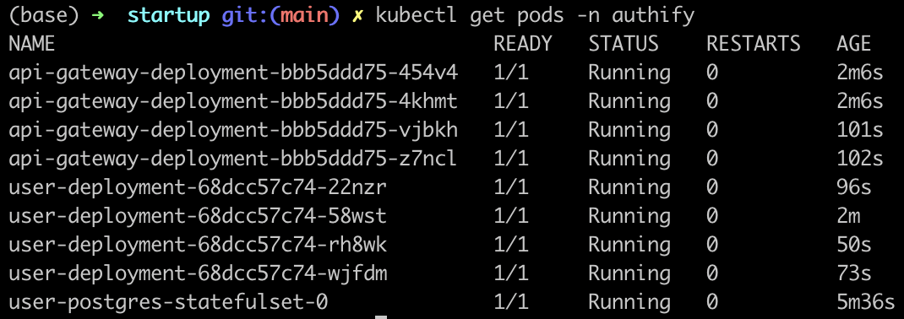
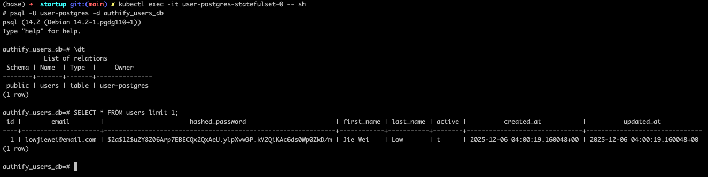
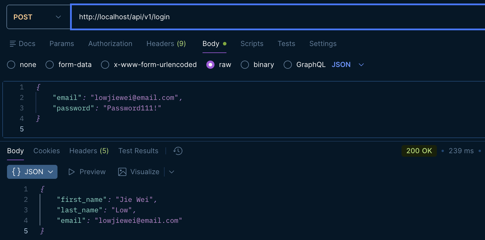

# Authify

Authify is a production-ready authentication and authorization microservice designed for modern, scalable applications.

# Table of Contents

- [Authify](#authify)
- [Table of Contents](#table-of-contents)
- [Project Setup](#project-setup)
  - [Localhost](#localhost)
  - [Docker](#docker)
  - [Local Kubernetes (Docker Desktop)](#local-kubernetes-docker-desktop)
- [AWS Deployment](#aws-deployment)
  - [AWS Elastic Beanstalk](#aws-elastic-beanstalk)

# Project Setup

There are multiple ways to start up authify microservices:

- Localhost
- Docker
- Local Kubernetes (Docker Desktop)

Ensure the following ports are available and not used:

| Service           | Port  |
| ----------------- | :---: |
| API Gateway       | 8080  |
| User Microservice | 50051 |
| Redis             | 6379  |
| PostgreSQL        | 5432  |
| Prometheus        | 8080  |
| Grafana           | 9090  |

We will be using `Makefile` to run `make` commands, navigate to that directory in `/startup`

## Localhost

1. Setup Postgres

```sh
# Login as Root user first to create a user and role for authify
psql postgres

# Create database authify_users_db
CREATE ROLE authify WITH LOGIN PASSWORD 'dba872b7';
CREATE DATABASE authify_users_db OWNER authify;
GRANT ALL PRIVILEGES ON DATABASE authify_users_db TO authify;

# Login as authify user and access database
psql -U authify -d authify_users_db

# Run the schema for user service
/user-service/schema/users.sql
```

<p align="center">
  
</p>

2. Run services (api gateway and user service), redis, prometheus, grafana.

```sh
# To start api-gateway service
make run SERVICE=api-gateway

# To start user service
make run SERVICE=user-service

# To start redis (runs redis in the background)
make run redis-server

# To start prometheus and pull metrics from application services
# http://localhost:9090/metrics
make prom

# To start grafana and pull metrics from Prometheus metrics store
# http://localhost:3000 (username: admin, password: admin)
make grafana
```

<p align="center">
  
</p>

3. Test API via POSTMAN

<p align="center">
  
</p>

## Docker

1. Start up api gateway, user service, postgres and redis server.

```sh
# Before running, ensure local redis-server is turned off because
# docker compose spins up it's own redis server
brew services stop redis

# Uses docker-compose.yaml file to start up the services.
make docker-build
```

<p align="center">
  
</p>

<p align="center">
  
</p>

2. Create schema in Docker PostgreSQL running as Docker container.

```sh
# Get the container name or ID
docker ps | grep postgres

# Find the DB and user
docker inspect user-postgres | grep -i POSTGRES_

# Create users table in authify_users_db database
docker exec -it user-postgres psql -U authify -d authify_users_db
```

<p align="center">
  
</p>

3. Test API via POSTMAN

<p align="center">
  
</p>

## Local Kubernetes (Docker Desktop)

1. To run Kubernetes StatefulSet locally, we need to create a Persistent Volume on our local machine which uses our machine's disk storage space.

```sh
mkdir -p $(echo $HOME)/persistent_volume/user-service
```

2. Update `hostPath` in Kubernetes PersistentVolume (PV) manifest file to store data.

```sh
# Navigate to PersistentVolume for user-service
/user-service/k8s/persistent-volume.yml

# Update the hostPath here (in my case, $HOME=/Users/leonlow)
hostPath:
  path: /Users/leonlow/persistent_volume/user-postgres
```

3. For local kubernetes, we rely on redis-server on our local machine to be started.

```sh
make redis-server
```

4. Apply k8s manifest files (Ingress, ClusterIP, Deployment, ConfigMap, Secret, Headless ClusterIP, StatefulSet, PersistentVolume, StorageClass)

```sh
# Applies k8s manifest files, switches k8s namespace to `authify`
make k8s-apply
```

<p align="center">
  
</p>

5. Ensure k8s Pods are running with `kubectl get pods -n authify`

<p align="center">
  
</p>

6. Create schema in Kubernetes PostgreSQL running as StatefulSet pod.

```sh
# Login to postgres as user-postgres
psql -U user-postgres -d authify_users_db

# Create the users table
/user-service/schema/users.sql
```

<p>
  
</p>

7. Test API via POSTMAN

<p align="center">
  
</p>

# AWS Deployment

## AWS Elastic Beanstalk

- For deployment steps, check out [IMS AWS Elastic Beanstalk Deployment Guide](./server/project/docs/AWS/aws-elastic-beanstalk/deployment.md)
- For deployment steps, check out [IMS AWS EC2 Deployment Guide](./server/project/docs/AWS/aws-ec2/deployment.md)
